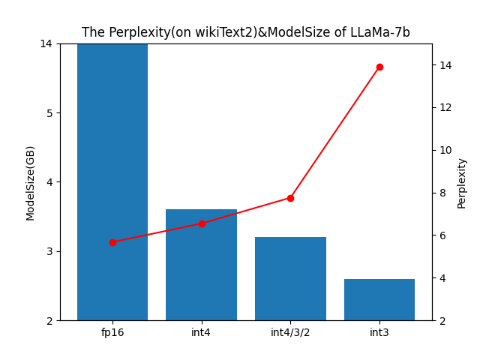
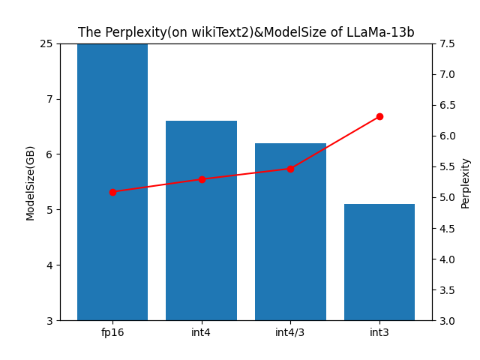
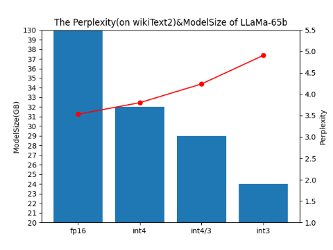

### Update News
- LLaMA-7B and 13B quantization are also available [here](https://huggingface.co/cnbeining/sparsebit-llama-quantization-7b-13b).
- We have updated a llama-13b checkpoint with 3-bit 128-group quantization [here](https://drive.google.com/file/d/1LjZmOU8tr2VT6HdAP_WbuX8cqmrs5DrR). For config_cache and tokenizer_cache, the files can be found [here in huggingface](https://huggingface.co/decapoda-research/llama-13b-hf).
- We implemented a cuda kernel for groupsize=128(int3/int4) & groupsize=64(int2). In our experiments, setting groupsize=128(int3) can make all quantization models achieve a significant increase in ppl compared to groupsize=-1. All results are updated in Table A.
- We add `--single_device_mode` to support all quant models run in a single GPU(i.e. 2080ti). Please refer to the inference section for details.

### Introduction
- In order to achieve a better trade-off between model size and the performance in quantizaiton of [LLaMA](https://research.facebook.com/publications/llama-open-and-efficient-foundation-language-models/), we implemented a mixed-precision quantization method based on [GPTQ](https://arxiv.org/abs/2210.17323) to replace the default single-precision quantization.
- Specifically, unlike adopting a single-precision bit-width throughout the entire network, our approach performs bit-width assignment based on the quantization sensitivity of each linear layer.
- We release conversion script for producing the quantized model files, and an inference example that can be run on GPU.
- In the future, we will continue to optimize our method to further explore smaller model sizes and higher precision. Additionally, we will also provide sparse+quantized versions soon.

### Prerequests
#### install transformers>=4.28.0

```
pip install transformers==4.28.0
```

#### Download pretrained weight
LLaMA-7b is used as an example here
```
from transformers import AutoTokenizer, AutoModelForCausalLM
tokenizer = AutoTokenizer.from_pretrained("decapoda-research/llama-7b-hf")
model = AutoModelForCausalLM.from_pretrained("decapoda-research/llama-7b-hf")
```

#### Fix tokenizer bug (May deprecate in the future)
LLaMA tokenizer can't be correctly used in transformers==4.28.0, so we need to fix it first.
LLaMA-7b is used as an example here.
```
cd /PATH_TO_HUGGINGFACE/hub/models--decapoda-research--llama-7b-hf/snapshots
cd SUB_FOLDER_NAME
vim tokenizer_config.json
"LLaMATokenizer"->"LlamaTokenizer"
```

### Run
#### Quantization
- All scales can be run in a single V100-32GB, but you need a large memory to load the fp16 checkpoint.

```
# usage
python3 convert.py huggingface_model_name --candidate-bits <bit-widths> --save /path/to/save

# example 
python3 convert.py decapoda-research/llama-7b-hf --candidate-bits 2 3 4 --save llama-7b_234w.pth.tar

# example with groupsizes
python3 convert.py decapoda-research/llama-13b-hf --candidate-bits 3 --groupsize 128 --save llama_13b_3w_group128.pth.tar
```

#### inference
- Now running inference of large models in a single device (even with GPU memory not capable for whole parameters) is supported. use `--single_device_mode` to enable the function.

```
# usage
python3 inference.py huggingface_model_name /path/to/checkpoint

# example
python3 inference.py decapoda-research/llama-7b-hf llama-7b_234w.pth.tar

# example run in single gpu
python3 inference.py decapoda-research/llama-65b-hf llama-65b_234w.pth.tar --single_device_mode

# example run a model with groupsize
python3 inference.py decapoda-research/llama-13b-hf llama_13b_3w_group128.pth.tar --groupsize 128
```

### Results
- quantization configure: token is kept as fp16 and the weights in linear will be quantized with per-channel scale and asysmetric.
- From these figures, it can be seen that our mixed-precision method provides an intermediate result that can be adapted according to specific resources during deployment. Additionally, if measured in terms of the number of perplexity (ppl) reduction per 100MB weight, mixed-precision-quantization can achieve less drop in perplexity under the same weight compared to directly converting to a fixed-precision version. Specifically, in LLaMA-7B from int4 -> int4/3/2, a reduction of 0.4GB weight leads to a decrease of ~1.2ppl. In comparison, int4->int3 will lead to a loss of ~7.4ppl for a 1GB reduction.
- We use groupsize=-1 in most experiments. ~~We use groupsize=-1 in all experiments, and it will get better results if setting groupsize=1024 or smaller, but our current CUDA kernel does not support it. For example, int4/3/2 with groupsize=128 will get **ppl=4.376(25G)** on wikiText2, which is significantly better than groupsize=-1(4.897(27G)). We will support it soon.~~

  

#### Table A

| bit-width | LLaMA-7b|LLaMA-13b|LLaMA-65b|
|---|---|---|---|
|fp16|5.673(14G)|5.088(25G)|3.532(130G)|
|int4|6.545(3.6G)|5.292(6.6G)|3.801(32G)|
|int4/3| 7.354(3.4G) |**5.465(6.2G)**|**4.239(29G)**|
|int4/3/2|**7.755(3.2G)**|~~5.700(6.0G)~~|~~4.897(27G)~~|
|int3|13.905(2.6G)|6.310(5.1G)|4.9056(24G)|
|int3 & groupsize=128 | 7.547(2.6G) | 5.52(5.1G) | 4.376(25G) | 

### Acknowledgement
- We are grateful for these excellent projects and list them as follows:
  - [GPTQ](https://github.com/IST-DASLab/gptq)
  - [zphang-transformers](https://github.com/zphang/transformers.git)

